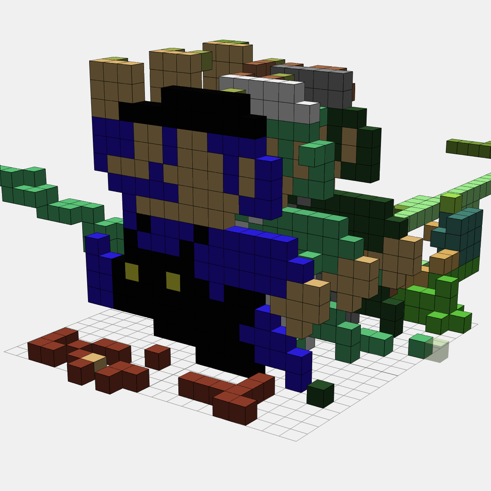

# voxel-editor-v3
ボクセルエディタのバージョン３です。  
- ネットワークで多人数同時編集が出来る
- データの保存が出来る
- 2D画像からボクセルをおこせる
## 楽しい体験にする
開発して楽しい  
ボクセルを作って楽しい  
他人を巻き込んで楽しい  
  
## 仕様
サーバ側  
- Node.js
- Socket.io
- MongoDB
フロント側  
- javascript
- three.js
保存データ形式  
- json
